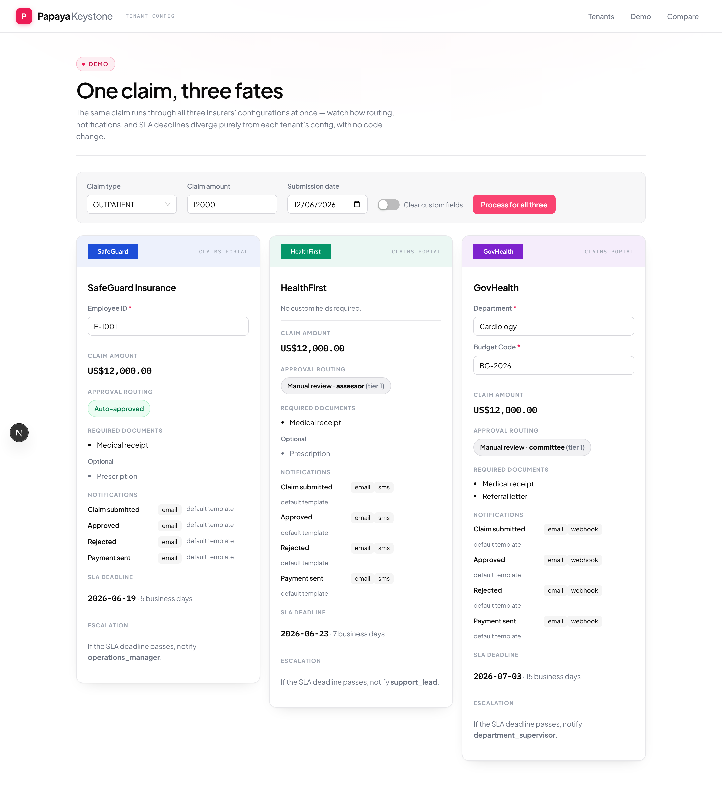
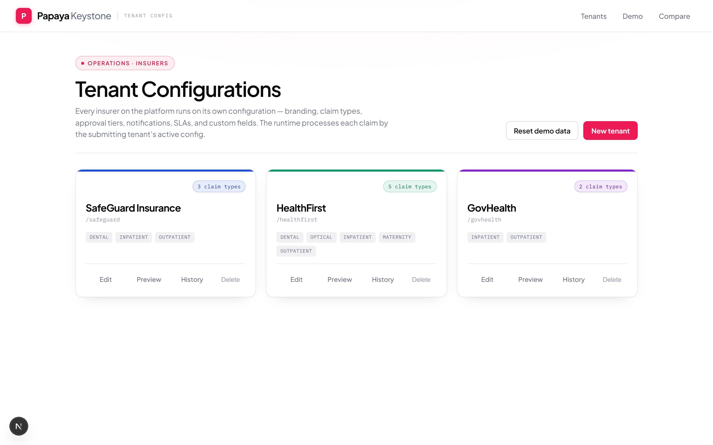
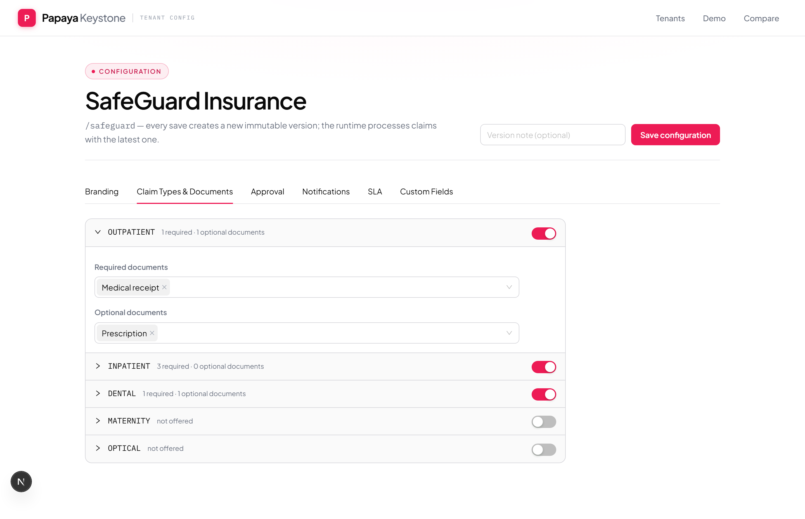
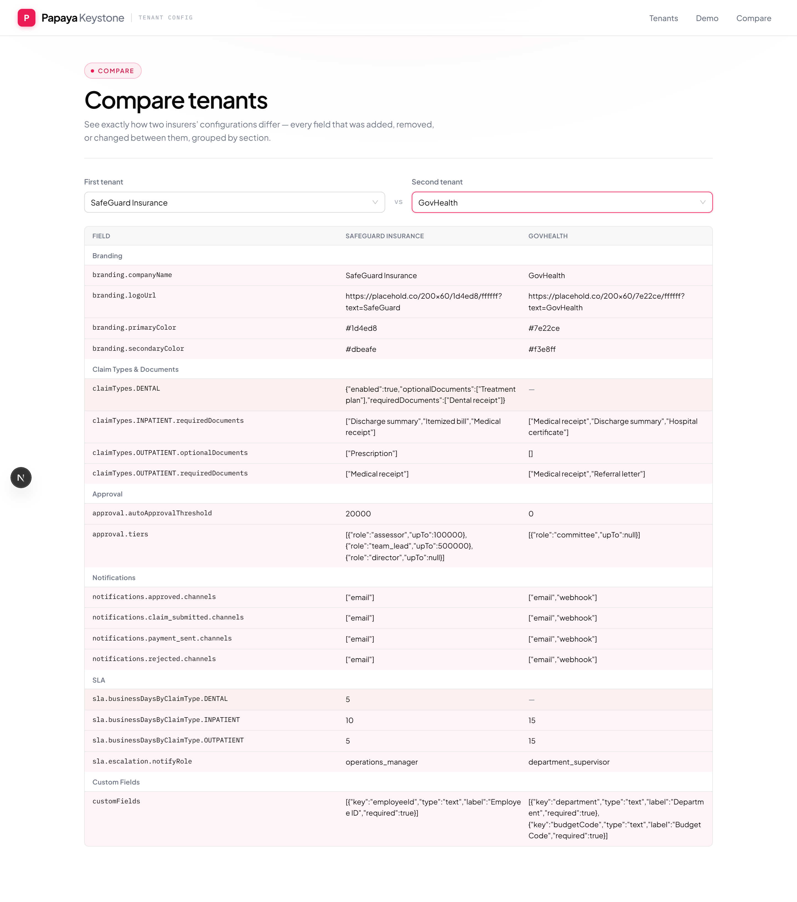

# Papaya Keystone — Multi-Tenant Configuration Platform

An insurance claims platform that serves multiple insurers (tenants) from one codebase.
Each tenant's branding, claim types, document requirements, approval rules, notifications,
SLAs, currency, and custom fields are **fully configurable through an admin UI —
onboarding a new insurer requires zero code changes**. A runtime engine then processes
every claim according to the submitting tenant's active configuration.

Built to the [AI Challenge 15 brief](https://github.com/papaya-insurtech/pumpkin/blob/main/AI_Engineering_Challenges/AI_Challenge_15.md).

**Live demo:** https://ai-engineering-challenges.vercel.app

> **Design philosophy:** configuration is *policy*, code is *mechanism*. A tenant's entire
> configuration is one JSON document validated by one schema; the runtime is a pure
> function over that document. Adding a tenant — or a new config dimension — is data, not code.

---

## One claim, three fates

The headline of the product, on the **/demo** page: the *same* claim runs through all three
seeded tenants at once and produces three different outcomes — purely from configuration.



The same claim (`OUTPATIENT`, amount 12,000, submitted Friday 2026-06-12):

|  | SafeGuard (corporate) | HealthFirst (retail) | GovHealth (government) |
|--|--|--|--|
| Approval | Auto-approved (< 20,000) | Assessor (≥ 5,000) | Committee (threshold 0 — nothing auto-approves) |
| Documents | Medical receipt | Medical receipt | Medical receipt + Referral letter |
| Notifications | email | email + SMS | email + webhook |
| SLA deadline | +5 business days → 2026-06-19 | +7 → 2026-06-23 | +15 → 2026-07-03 |
| Custom fields | Employee ID required | none | Department + Budget Code required |

Three edge cases this encodes: business-day math skips weekends; a boundary amount belongs
to the higher tier (half-open intervals); an auto-approval threshold of `0` auto-approves
nothing.

---

## What's inside

| Tenant list (`/`) | Config editor (`/tenants/[id]`) |
|---|---|
|  |  |
| Branded cards · create · reset demo · delete | Six tabs · inline validation · save = new version |

| Compare two tenants (`/diff`) |
|---|
|  |

Six pages, all backed by the same engine and schema:

- **`/`** — tenant list (each in its own brand colour), create a tenant, reset demo data, delete a tenant.
- **`/tenants/[id]`** — config editor: six tabs (Branding · Claim Types & Documents · Approval · Notifications · SLA · Custom Fields) with inline Zod validation; every save creates a new version.
- **`/tenants/[id]/preview`** — enter a sample claim → see exactly how this tenant would process it, rendered in the tenant's branding, via the real runtime endpoint.
- **`/tenants/[id]/history`** — version list; **view** a past version's full config, **diff** it against current, and **roll back** (forward-only).
- **`/diff`** — pick two tenants → side-by-side diff grouped by section.
- **`/demo`** — one claim → three tenants → three outcomes.

---

## Architecture

- **One config document per tenant, one Zod schema.** The schema is the single source of
  truth, shared by client and server. Invalid configurations (no enabled claim type,
  negative SLA, overlapping approval tiers, a threshold that strands the first tier, a
  `select` field with no options, …) are rejected on **both** sides — even when the API is
  called directly, bypassing the UI.
- **One pure engine.** `processClaim(config, claim)` does no I/O. The runtime API, the
  preview screen, the demo page, and the unit tests all call the same function, so **preview
  can never drift from runtime**.
- **Versioned, forward-only persistence.** Every save writes a new immutable JSONB version
  row and repoints the tenant's active version. History, diff, and rollback are cheap reads;
  rollback creates a *new* version rather than rewriting history (audit-safe).
- **Serverless-durable database.** Prisma 7 with the Neon serverless driver adapter — a
  tenant created through the UI survives restarts, cold starts, and redeploys.
- **Modular by construction.** A new config dimension is one schema field + one engine line +
  one control. The per-tenant **currency** setting was added this way; the diff is the proof.

```
Admin UI (Next.js App Router · Ant Design · TypeScript strict)
   │  fetch — Zod-validated on both sides
API route handlers (CRUD tenants/versions · process-claim · reset-demo)
   │                                    │
Neon PostgreSQL (Prisma 7, 2 tables)    lib/engine — processClaim(config, claim)
                                        PURE FUNCTION, no I/O
```

## Tech stack

Next.js 16 (App Router) · TypeScript (strict) · Ant Design v6 · Zod 4 · Prisma 7 + Neon
(PostgreSQL, serverless driver adapter) · Vitest · Playwright · Vercel.

---

## Quickstart

### Prerequisites
- Node.js 20+
- A Neon PostgreSQL database (free tier) — use its **pooled** connection string (host contains `-pooler`).

### Setup
```bash
npm install                      # postinstall runs `prisma generate`
cp .env.example .env             # set DATABASE_URL to your Neon pooled connection string
npx prisma migrate dev           # apply the schema
npx prisma generate              # Prisma 7 doesn't auto-run this after migrate
```

### Run
```bash
npm run dev                      # http://localhost:3000
```
Open the app and click **Reset demo data** to seed the three sample insurers.

### Deployment (Vercel + Neon)
1. Import the repo in Vercel; set the `DATABASE_URL` env var to the Neon pooled connection string.
2. Deploy. The build runs `prisma generate` via `postinstall`, then `next build`.
3. Run `npx prisma migrate deploy` against the Neon database, then `POST /api/reset-demo`
   (or click **Reset demo data**) to seed.

Because data lives in Neon, a tenant created through the UI persists across redeploys.

---

## Testing

```bash
npm run test              # Vitest unit suite — 54 tests (pure, offline)
npm run test:integration  # versioning/rollback against real Neon (needs DATABASE_URL)
npm run test:e2e          # Playwright — 28 specs against a real dev server + Neon
```

- **Unit (54):** schema validation rules, engine boundary semantics (tier boundaries,
  threshold 0, disabled claim types, custom-field validation, currency echo), business-day
  math across weekends, the generic deep-diff and config-flatten, seed tenants, the
  three-tenant worked example.
- **Integration (1):** forward-only versioning + rollback against real Neon.
- **E2E (28):** `admin-flows.spec.ts` (the critical journeys) + `edge-cases.spec.ts` (every
  cross-field rule enforced through the UI, not-found states, stale-id recovery). Run against
  a deployed URL with `E2E_BASE_URL=<url> npm run test:e2e`.

---

## Project structure

```
src/
  app/
    api/        # route handlers: tenants (CRUD), config, versions, rollback, process-claim, reset-demo
    tenants/[id]/{,preview,history}   # editor · preview · history pages
    diff/ · demo/                     # compare · one-claim-three-fates
  components/   # TenantCard, config-editor/ (6 tabs), ClaimForm, ProcessResultPanel,
                # BrandingFrame, DiffTable, ConfigView, VersionDrawer
  lib/
    config/     # Zod config schema (single source of truth), seed tenants, default config
    engine/     # processClaim (pure runtime), business-day calculator, claim-input guard
    diff/       # generic deep-diff + config-flatten
    db/         # Prisma 7 client wired to the Neon serverless adapter + tenant repository
prisma/         # schema + migrations
docs/           # writeup, demo script, design spec, implementation plan, progress log
```

## Documentation

- [docs/WRITEUP.md](docs/WRITEUP.md) — approach, key decisions and trade-offs, how AI was used
- [docs/DEMO_SCRIPT.md](docs/DEMO_SCRIPT.md) — a step-by-step demo walkthrough
- [docs/PROGRESS.md](docs/PROGRESS.md) — live project state and decision log
- [docs/superpowers/specs/](docs/superpowers/specs/) — product design spec
- [docs/superpowers/plans/](docs/superpowers/plans/) — implementation plan with per-task verification

## Scope & trade-offs

- **No authentication** — out of scope for this challenge; the public demo is protected only
  by a "Reset demo data" action. In production this would sit behind tenant-scoped auth.
- **Business days skip weekends only** — no public-holiday calendar yet; the schema leaves
  room for it as a future dimension.
- **Notifications are planned, not delivered** — the engine returns *which* notifications
  would fire on which channels; actually sending email/SMS/webhooks is out of scope.
